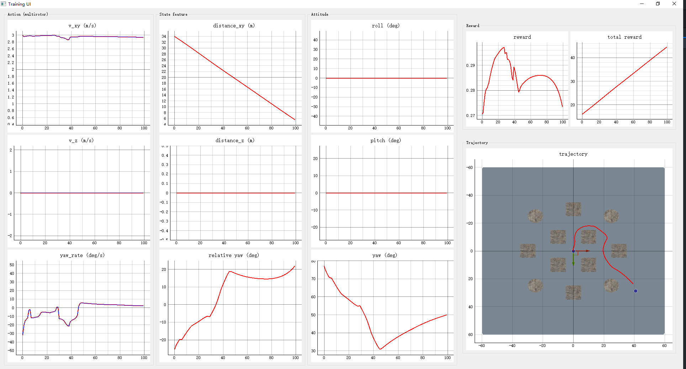

# UAV_Navigation_DRL_AirSim

This is a new repo used for training UAV navigation (local path planning) policy using DRL methods.

<p align="center">
  
  
  <!-- 
   -->
</p>

## ChangeLog

- 2020-03-11
  - Add wandb support
- 2020-03-10
  - Remove [gym_airsim_multirotor](https://github.com/heleidsn/gym_airsim_multirotor) submodule
  - Add gym_env as envrionment, include MultirotorSimple, Multirotor and FixedwingSimple dynamics
  - Add train with plot
  - Add SimpleAvoid UE4 environment

## Requirements

- [AirSim](https://microsoft.github.io/AirSim/) v1.6.0
- pytorch 1.10.1
- gym-0.21.0
- Pyqt5 5.15.6
- keyboard 0.13.5

## Submodules

- [Stable-baselines3](https://github.com/heleidsn/stable-baselines3) v1.4.0

## Install CUDA and PyTorch (Win10)

- Download [CUDA11.6](https://developer.nvidia.com/cuda-downloads?target_os=Windows&target_arch=x86_64&target_version=10&target_type=exe_local)
- `pip3 install torch==1.10.1+cu113 torchvision==0.11.2+cu113 torchaudio===0.10.1+cu113 -f https://download.pytorch.org/whl/cu113/torch_stable.html`

## Usage

1. Clone this repo and the submodules

   1. `git clone https://github.com/heleidsn/UAV_Navigation_DRL_AirSim.git --recursive`
2. Install gym_env

   1. `cd gym_env`
   2. `pip install -e .`
3. Install customized stable-baselines3

   1. `cd stable-baselines3`
   2. `pip install -e .`
4. Download a AirSim environment, such as Blocks from [Here](https://github.com/microsoft/AirSim/releases/tag/v1.6.0-windows) and run it
5. Start training

   1. `cd UAV_Navigation_DRL_AirSim`
   2. `python scripts/start_train_with_plot.py`
6. Evaluation

   1. `cd UAV_Navigation_DRL_AirSim`
   2. `python scripts/start_evaluate_with_plot.py`

## Configs

This repo using config file to control training conditions.

Now we provide 3 training envrionment and 3 dynamics.

**env_name**

* SimpleAvoid
  * This is a custom UE4 environment used for simple obstacle avoidance test. You can download it from [google drive](https://drive.google.com/file/d/1QgkZY5-GXRr93QTV-s2d2OCoVSndADAM/view?usp=sharing).
  * 
* NH
  * 
* City (for fixedwing)
  * 

**dynamic_name**

* SimpleMultirotor
* Multirotor
* SimpleFixedwing

## GUI for training and evaluation



## Wandb support

[Wandb](https://wandb.ai/site) is a central dashboard to keep track of your hyperparameters, system metrics. You can find examples [here](https://docs.wandb.ai/guides/integrations/other/stable-baselines-3).

> Note: If you use wandb, please run python as **administators**.

## Results

- Training result using TD3 with no_cnn policy
  - 

## Settings

For

```json
{
  "SeeDocsAt": "https://github.com/Microsoft/AirSim/blob/master/docs/settings.md",
  "SettingsVersion": 1.2,
  "SimMode": "ComputerVision",
  "SubWindows": [
    {"WindowID": 0, "CameraID": 0, "ImageType": 0, "Visible": true},
    {"WindowID": 1, "CameraID": 0, "ImageType": 3, "Visible": false},
    {"WindowID": 2, "CameraID": 0, "ImageType": 3, "Visible": true}
    ],
  "CameraDefaults": {
    "CaptureSettings": [
      {
        "ImageType": 3,
        "Width": 100,
        "Height": 80,
        "FOV_Degrees": 90,
        "AutoExposureSpeed": 100,
        "AutoExposureBias": 0,
        "AutoExposureMaxBrightness": 0.64,
        "AutoExposureMinBrightness": 0.03,
        "MotionBlurAmount": 0,
        "TargetGamma": 1.0,
        "ProjectionMode": "",
        "OrthoWidth": 5.12
      },
      {
        "ImageType": 0,
        "Width": 256,
        "Height": 144,
        "FOV_Degrees": 90,
        "AutoExposureSpeed": 100,
        "AutoExposureBias": 0,
        "AutoExposureMaxBrightness": 0.64,
        "AutoExposureMinBrightness": 0.03,
        "MotionBlurAmount": 0,
        "TargetGamma": 1.0,
        "ProjectionMode": "",
        "OrthoWidth": 5.12
      }
    ]
  }
}
```
